# passcheckers_backend
# 🧳 PassCheckers Backend

> YOLO 객체 인식을 기반으로 한 수하물 분류 및 안내 시스템  
> **2025 캡스톤디자인 팀 프로젝트**

[](https://pypi.org/project/Flask/)
[](https://www.python.org/downloads/release/python-31011/)
[](https://dev.mysql.com/)
[](https://github.com/WongKinYiu/yolov11)

---

## 🖼️ 프로젝트 개요

**PassCheckers**는 사용자가 업로드한 수하물 이미지를 분석하여  
YOLOv11 기반 커스텀 모델로 수하물 항목을 자동 인식하고,  
수하물 무게 추정, 패킹 추천, 다중 분류 기능 등을 제공하는 웹 기반 시스템입니다.

**이 저장소는 Flask 기반의 백엔드 API 서버**입니다.

---

## ⚙️ 주요 기능

- 📤 **이미지 업로드** 및 YOLO 추론 요청
- 🧠 **YOLOv11 기반 수하물 분류 (단일/다중)**
- ⚖️ **무게 추정 (클래스별 평균 무게 기반)**
- 🧳 **패킹 도우미 (필수 품목 추천)**
- 🏷️ **미탐지 항목 수동 태그 기능 (외부 API 예정)**

---

## 📁 프로젝트 구조

```plaintext
passcheckers_backend/
├── app/
│   ├── __init__.py                 # Flask 앱 초기화 및 블루프린트 등록
│   ├── matching/                   # 매칭 관련 서비스 로직
│   │   ├── __init__.py
│   │   ├── item_service.py
│   ├── models/                     # 데이터베이스 모델 정의
│   │   ├── __init__.py
│   │   └── item_model.py
│   ├── routes/                    # API 엔드포인트
│   │   ├── __init__.py
│   │   ├── classify.py             # YOLO 추론 API
│   │   ├── items.py                # 아이템 관련 API
│   │   ├── weight_predict.py       # 무게 예측 API
│   ├── scraping/                  # 외부 데이터 수집 관련 스크립트
│   │   ├── translate_csv.py
│   │   └── TSA 규정.py
│   ├── utils/                     # 유틸리티 함수 모음
│   │   └── helpers.py
│   ├── weight/                    # 무게 예측 로직
│   │   └── predictor.py
│   └── yolo/                     # YOLO 모델 관련 코드
│       ├── weights/              
│       └── detect.py              # YOLO 추론 로직
├── docs/                         # 프로젝트 문서 및 개발 팁
│   ├── dev_tips.md
│   └── structure.md
├── static/                       # 정적 파일 (결과 이미지 등)
│   └── results/
├── templates/                    # (필요 시) HTML 템플릿
├── uploads/                      # 업로드 이미지 임시 저장
├── venv/                        # Python 가상환경
├── .gitignore                   # Git 무시 설정
├── config.py                    # 환경 설정
├── insertDB.py                  
├── LICENSE                     
├── mysql.py                     
├── populate_db.py              
├── README.md                   
├── requirements.txt            
└── run.py                      # Flask 서버 실행 진입점

---

## 🧪 실행 방법

### 1. 클론 및 가상환경 설정

```bash
git clone https://github.com/YOUR_ID/passcheckers_backend.git
cd passcheckers_backend

# 가상환경 설정
python -m venv venv
venv\Scripts\activate      # Windows
# source venv/bin/activate # macOS/Linux

# 의존성 설치
pip install -r requirements.txt
```

### 2. 서버 실행

```bash
python run.py
```

### 3. 테스트

브라우저 또는 Postman 등으로 다음 주소 접속:

```
http://localhost:5000/test
```

---

## 🔧 기술 스택

| 분류 | 기술 |
|------|------|
| 백엔드 | Python 3.10, Flask 3.1 |
| 모델 | YOLOv11 (커스텀 학습) |
| 데이터베이스 | MySQL 8.0 |
| 인프라 (추후) | Nginx, Docker |
| 기타 | OpenCV, NumPy, Pillow 등 |

---

## 🧭 시스템 흐름도

```mermaid
graph LR
A[사용자] --> B[이미지 업로드 요청]
B --> C[Flask API 서버]
C --> D[YOLO 모델 추론]
D --> E[추론 결과 처리]
E --> F[클래스, 바운딩박스 반환]
F --> G[프론트 렌더링]
```



---

## 📸 샘플 예시 (시각화)

| 입력 이미지 | 분류 결과 |
|-------------|------------|
|  |  |

※ 예시 이미지는 `static/` 폴더에 추가하여 사용하세요.

---

## 👨‍👩‍👧‍👦 팀원 소개

| 이름 | 역할 |
|------|------|
| 이상민 | 🧠 YOLO 커스텀 모델 학습, 백엔드 API 개발, 📊 데이터 수집/분석 |
| 김민한 | ⚙️ 시스템 설계, 무게 예측/패킹 알고리즘 개발 |
| 이상호 | 💻 프론트엔드 개발, UI/UX 설계 |

---

## ✅ 앞으로 할 일

- [x] YOLO 기반 분류 API 구현
- [ ] 수하물 무게 예측 기능 구현
- [ ] 미탐지 항목 태깅 기능
- [ ] 패키징 도우미 UI 구상
- [ ] 부가 기능 API 연동
- [ ] Docker/Nginx 배포 환경 구성

---

## 📬 문의

> GitHub [Issues 탭](https://github.com/YOUR_ID/passcheckers_backend/issues)을 이용해 주세요.

